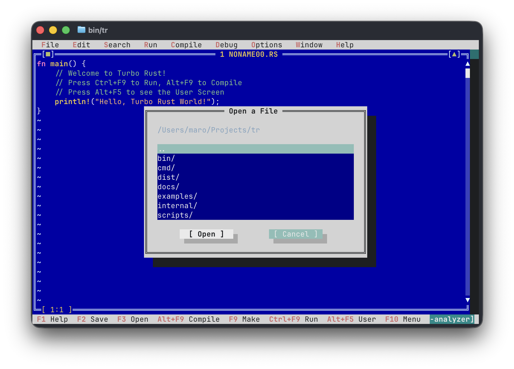

[한국어](./README.ko.md) | [English](./README.md)

# Turbo Rust (Version 0.90)

> **볼랜드 Turbo Pascal / Turbo C 레트로 감성의 Rust 전용 TUI IDE**

**Turbo Rust (`tr`)**는 90년대 볼랜드(Borland)의 전설적인 **Turbo Pascal**과 **Turbo C** 특유의 비주얼 인터페이스(시그니처 터보 블루 에디터 창 `#0000A8`, 이중선 프레임 `╔═╗`, 상단 드롭다운 메뉴바, 하단 핫키 바, `Alt+F5` User Screen)에 현대의 **Rust 툴체인(`rustc`, `cargo`)**을 완벽하게 융합한 레트로 터미널 개발 환경(TUI IDE)입니다.

Go 언어와 `tcell/v2`로 구현되어 단일 실행 파일로 즉시 실행되며, 깜빡임 없는 터미널 렌더링을 제공합니다.

---

<p align="center">
  
</p>

---

## 주요 특징

- **Classic Borland Turbo Vision UI**:
  - 시그니처 터보 블루 에디터 캔버스 (`#0000A8`) 및 이중선 박스 드로잉 (`╔═╗`, `║ ║`, `╚═╝`)
  - 입체 텍스트 그림자(Drop Shadow) 및 레트로 윈도우 헤더 (`[■] 1 NONAME00.RS [▲]`)
  - 상단 풀다운 메뉴바 (`File`, `Edit`, `Search`, `Run`, `Compile`, `Debug`, `Options`, `Window`, `Help`)
  - 하단 단축키 바 (`F1 Help`, `F2 Save`, `F3 Open`, `Alt+F9 Compile`, `F9 Make`, `Ctrl+F9 Run`, `Alt+F5 User`, `F10 Menu`)
- **Rust Syntax Highlighting**:
  - Rust 2021/2024 키워드, 타입(`i32`, `String`, `Option`, `Result` 등), 매크로(`println!`), 라이프타임(`'a`), 리터럴, 주석 구문 강조
- **Compiling 모달 다이얼로그 & 컴파일 에러 점프**:
  - 컴파일 시 볼랜드 특유의 "Compiling..." 팝업 박스(대상 파일, 총 라인 수, 에러/워닝 수, 빌드 경과 시간)
  - 컴파일 에러 발생 시 파일명/라인/에러 목록 표시 및 **에디터 해당 줄과 열로 즉시 점프**
- **Alt+F5 User Screen**:
  - Turbo C의 상징적인 기능! 빌드 실행 결과를 별도의 전체화면 DOS 콘솔 뷰어로 전환하여 확인하고, 아무 키나 누르면 다시 Turbo Rust IDE로 복귀
- **인터랙티브 디버거 & Watches 창**:
  - `F4`로 브레이크포인트(`●`) 설정/해제 ➔ **한 줄 전체 빨간색 바(`Red`)** 표시
  - `F5` 디버깅 시작 / Continue, `F8` Step Over, `F7` Trace Into
  * 실행 중 현재 멈춘 라인은 **한 줄 전체 노란색 바(`Yellow` `►`)**로 시선 집중
  * 하단 **Watches 윈도우**(Debug 메뉴)를 통해 변수명, 타입, 값을 실시간 감시
- **볼랜드 레트로 사운드 이펙트 (Sound FX)**:
  - 컴파일 성공 시 경쾌한 2단 비프음, 컴파일 에러 시 묵직한 에러음
  - 디버거 브레이크포인트 적중 시 피에조 클릭 사운드

---

## 단축키 안내

| 단축키 | 기능 | 설명 |
|---|---|---|
| **Alt + F** | **File Menu** | File 메뉴 즉시 열기 |
| **Alt + E** | **Edit Menu** | Edit 메뉴 즉시 열기 |
| **Alt + S** | **Search Menu** | Search 메뉴 즉시 열기 |
| **Alt + R** | **Run Menu** | Run 메뉴 즉시 열기 |
| **Alt + C** | **Compile Menu** | Compile 메뉴 즉시 열기 |
| **Alt + D** | **Debug Menu** | Debug 메뉴 즉시 열기 |
| **Alt + O** | **Options Menu** | Options 메뉴 즉시 열기 |
| **Alt + W** | **Window Menu** | Window 메뉴 즉시 열기 |
| **Alt + H** | **Help Menu** | Help 메뉴 즉시 열기 |
| **F1** | Help / About | Turbo Rust 정보 및 도움말 대화상자 |
| **F2** | Save | 현재 버퍼 저장 / 다른 이름으로 저장 |
| **F3** | Open | 파일 브라우저 다이얼로그 열기 (`.rs` 필터링) |
| **F4** | **Breakpoint** | 현재 라인 브레이크포인트(`●`) 설정/해제 |
| **F5** | **Debug / Continue** | 디버깅 시작 / 다음 브레이크포인트까지 계속 실행 |
| **F7** | **Trace Into** | 한 줄씩 실행 (함수/명령 진입) |
| **F8** | **Step Over** | 한 줄씩 실행 (함수 건너뛰기) |
| **Ctrl + F2** | **Reset Debugger** | 디버깅 세션 종료 및 실행 포인터 초기화 |
| **Ctrl + F** | **Find** | 문자열 검색 다이얼로그 열기 |
| **Ctrl + L** | **Search Again** | 이전 검색어로 다음 위치 계속 찾기 (Find Next) |
| **Alt + G** | **Go to Line** | 특정 줄 번호로 커서 이동 (`Ctrl+G`) |
| **Alt + L** | **Line Numbers** | 왼쪽 줄 번호 표시 On / Off 토글 (`F6`) |
| **Ctrl + F9** | **Run** | 빌드 후 일반 실행 및 결과 화면(**User Screen**) 표시 |
| **Alt + F9** | **Compile** | "Compiling..." 통계 팝업과 함께 빌드 실행 |
| **F9** | Make | 빌드 실행 (`rustc` / `cargo`) |
| **Alt + F5** | **User Screen** | 프로그램 실행 결과 화면 토글 |
| **F10** | Menu Bar | 상단 풀다운 메뉴바 포커스 토글 |
| **Alt + X** | Exit | Turbo Rust 종료 |
| **Ctrl + 좌 / 우 방향키** | **단어 단위 이동** | 단어 단위로 커서 좌우 이동 (macOS: **Option + 좌 / 우**) |
| **Shift + 방향키** | **Select Block** | 텍스트 영역 블록 선택 (Ctrl/Option 조합 시 단어 단위 블록 선택) |
| **Ctrl + A** | **Select All** | 버퍼 전체 텍스트 블록 선택 (`Edit ➔ Select All`) |
| **Ctrl + C** / **Ctrl + Ins** | **Copy** | 선택한 블록 클립보드에 복사 (`Edit ➔ Copy`) |
| **Ctrl + X** / **Shift + Del** | **Cut** | 선택한 블록 잘라내어 클립보드에 저장 (`Edit ➔ Cut`) |
| **Ctrl + V** / **Shift + Ins** | **Paste** | 클립보드 내용 커서 위치에 붙여넣기 (`Edit ➔ Paste`) |
| **Esc** | Close | 활성 메뉴/팝업 다이얼로그 닫기, 선택 해제 |

> [!TIP]
> **macOS 터미널 Option(Alt) 키 설정 안내**:
> macOS 환경에서 `Alt` 키 조합 단축키(`Alt+F`, `Alt+X`, `Alt+F9`, `Alt+F5` 등)를 정상적으로 사용하려면 터미널 옵션에서 **Option(Alt) 키를 Meta 키로 동작하도록 설정**해야 합니다:
> - **기본 터미널(Terminal.app)**: `설정(Settings)` ➔ `프로파일(Profiles)` ➔ `키보드(Keyboard)` ➔ **"Option 키를 Meta 키로 사용(Use Option as Meta key)"** 체크
> - **iTerm2**: `Settings` ➔ `Profiles` ➔ `Keys` ➔ `Left/Right Option Key`를 **"Esc+"**로 지정

---

## 설치 및 빌드 방법

### 1. 사전 빌드된 바이너리 다운로드 (GitHub Releases)

[GitHub Releases](https://github.com/MaroShim/TurboRust/releases)에서 OS별로 빌드된 독립 실행 파일을 즉시 다운로드하여 사용할 수 있습니다:
* **macOS (Apple Silicon)**: `tr-v0.90-darwin-arm64.tar.gz`
* **Linux (64-bit)**: `tr-v0.90-linux-amd64.tar.gz`
* **Windows (64-bit)**: `tr-v0.90-windows-amd64.zip`

> [!NOTE]
> **Windows Defender / SmartScreen 오진 안내**:
> 유료 상용 코드 서명(Code Signing) 인증서가 적용되지 않은 순수 오픈소스 바이너리 특성상, 윈도우 디펜더(Windows Defender) 또는 SmartScreen에서 바이러스/위험 파일로 오진(False Positive)할 수 있습니다.
> SmartScreen 경고 창이 나타날 경우 **"추가 정보" ➔ "실행"**을 누르시거나 백신 예외 처리를 하시면 안전하게 실행하실 수 있습니다. 오진이 염려되시는 경우 아래의 Go 소스 빌드 방식을 이용하시면 소스로부터 신뢰할 수 있는 바이너리를 직접 컴파일하여 사용하실 수 있습니다.

### 2. Go 명령어로 즉시 설치 (권장)

```bash
go install github.com/MaroShim/TurboRust/cmd/tr@latest
```

`$GOPATH/bin` (또는 `~/go/bin`)이 `$PATH` 환경 변수에 등록되어 있다면 터미널 어디서나 바로 실행할 수 있습니다:

```bash
tr
# 또는 특정 파일 바로 열기:
tr examples/hello.rs
```

### 3. 소스코드로부터 직접 빌드

```bash
git clone https://github.com/MaroShim/TurboRust.git
cd TurboRust
go build -o bin/tr ./cmd/tr
./bin/tr
```
